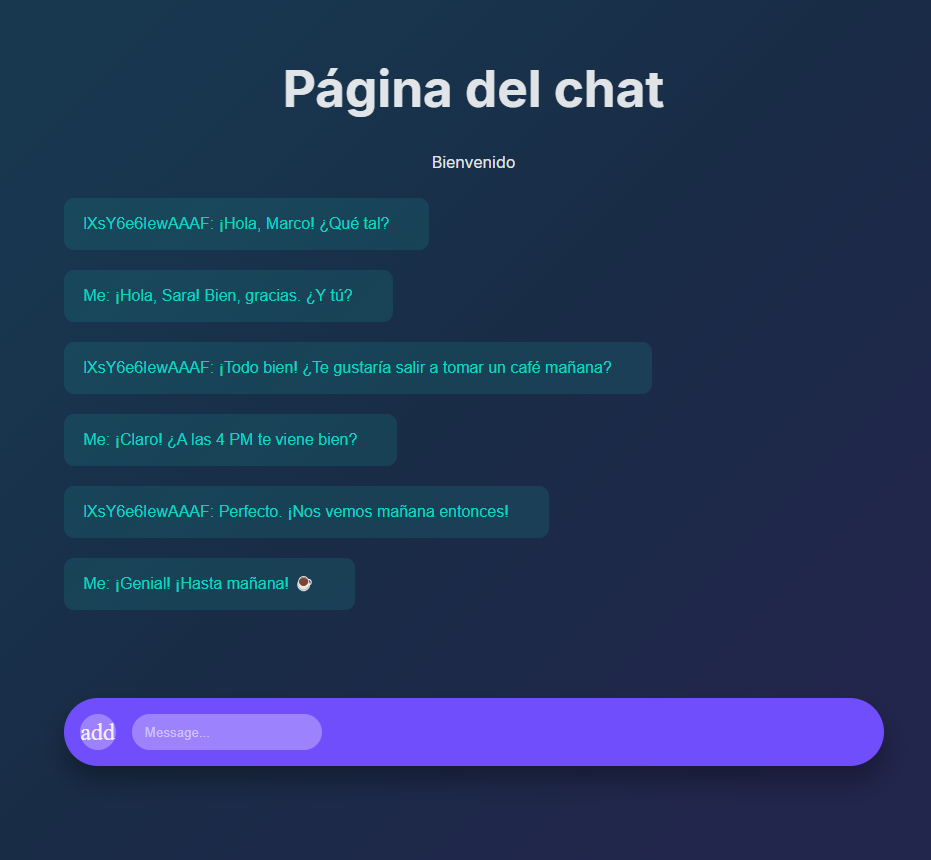
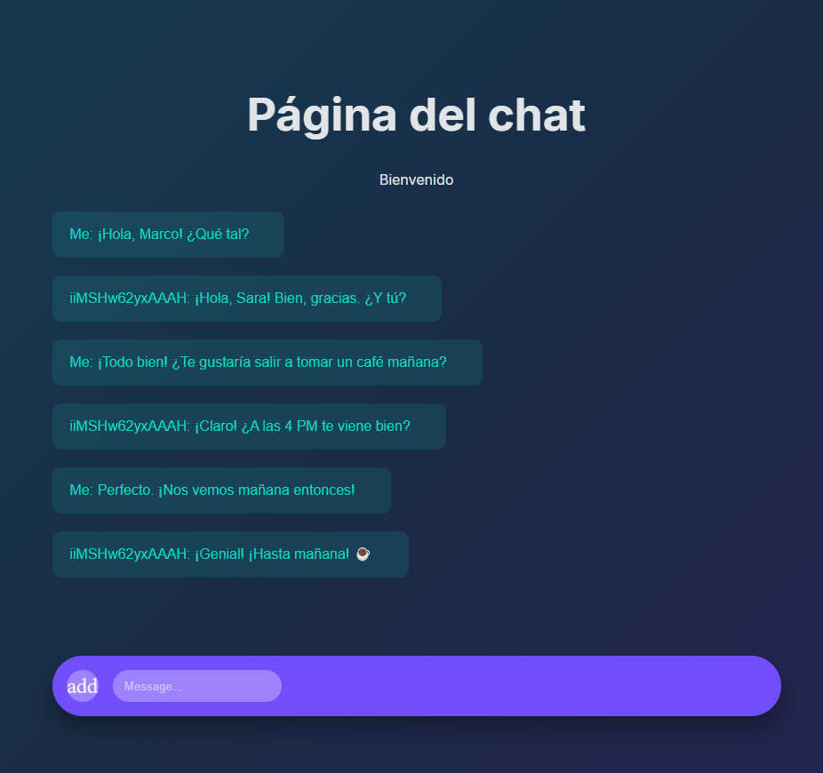

  <h1> Chat </h1> 

    
    

# Descripción
 Chat en tiempo real usando Socket.IO. El cliente solicita el nombre del usuario y permite enviar y recibir mensajes, actualizando el historial del chat y mostrando notificaciones cuando nuevos usuarios se conectan. El servidor gestiona las conexiones, difunde los mensajes a todos los usuarios conectados y emite notificaciones de nuevos usuarios, además de manejar las desconexiones.
# Javascript en el frontend
El código muestra una alerta inicial pidiendo al usuario que ingrese su nombre, lo almacena y envía un evento de autenticación al servidor. Luego, al hacer clic en el botón de enviar, el usuario envía mensajes al servidor, que los agrega al historial mostrado en el panel de chat. Además, cuando un nuevo usuario se conecta, se muestra una notificación de éxito si el usuario ya está registrado.

~~~ Javascript

let user; 

swal.fire({ 
    title: "Bienvenidos",
    text: "Por favor, ingresa tu nombre de usuario",
    input:"text",
  
    inputValidator:(value) => {
        return !value && "No ingresaste tu nombre tu usuario"
    },
    allowOutsideClick:false,
    allowEscapeKey:false,
}).then((inputValue)=>{
   user = inputValue.value;
   userName.innerHTML = user;
   socketClient.emit("authenticated",user);
});

sendMsg.addEventListener("click", ()=>{
    const msg = {user:user, message:inputMsg.value}
    socketClient.emit("msgChat",msg);
});

// recibe del servidor
socketClient.on("chatHistory", (dataServer)=>{
   let msgElements = "";
   dataServer.forEach(element => {
      msgElements+= `
Usuario: ${element.user}:  ${element.message}`
   });

   chatPanel.innerHTML = msgElements;
});
// recibimos al cliente que se acaba de conectar
socketClient.on("newUser",(data) =>{
    if (user) {
        Swal.fire({
            position: 'top-end',
            icon: 'success',
            title: data,
            showConfirmButton: false,
            timer: 1500
          });
    }
   
});
~~~

# Socket servidor
El código del servidor maneja las conexiones de sockets de los usuarios: al conectarse, el servidor imprime el ID del socket y debería enviar el historial del chat. Recibe mensajes de los usuarios y los difunde globalmente a todos menos al remitente, además de emitir una notificación cuando un usuario se autentica. También maneja la desconexión de usuarios, imprimiendo un mensaje en la consola cuando un usuario se desconecta. La lógica para enviar el historial del chat a todos los usuarios conectados está comentada, y el código incluye un fragmento para emitir mensajes globales en lugar de solo al remitente.
~~~ Javascript
io.on("connection",(socket)=>{
// recibimos el mensaje de cada usuario
    socket.on("message", (body)=>{
        socket.broadcast.emit("message",{
            body,
            from:socket.id.slice(6)
        });
   
    });

    // recibimos mensaje de coneccion de nuevo cliente
    socket.on("authenticated",(data)=>{
        socket.broadcast.emit("newUser",`El usuario ${data.name} se acaba de conectar `)
    });

    socket.on("disconnect", () => {
        console.log("se a desconectado un usuario");
    })
});
~~~